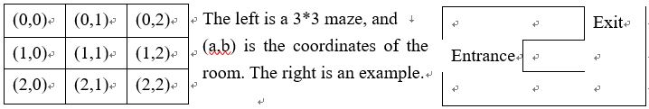

# Leave-the-maze
## Purpose:
Training **Inter-Process Communication(IPC)** and **Remote Procedure Call(RPC)** in Linux.

---
## Rules:

1. Each room should be implemented by a room structure, and the room structure contains five short vale, as shown the following:
>- struct room { short status[5]; }.
>- The value stored in the status value is from 0 to 6; 0 means nothing; 1 means wall; 2 means no wall; 3 means exit; 4 means entrance.
>- The status[0] used to represent the upper wall status, the status[1] used to represent the left wall status, the status[2] used to represent the right wall status, the status[3] used to represent the below wall status, and the status[4] is reserved for future used. So, the (1,0) can be represent as status[2][4][1][2][0].
2. The maze structure will be stored in a file. The first line of the maze file is represent as (x,y), where x is the row size and y is the colon size. From the second line to the (x*y+1) line is the room’s status values. The room number stored in the file are (0,0), (0,1), (0,2), … (x-1,y-1). So the maze file of Fig. 2 is shown the following:
>- 3,3
>- 1,1,2,2,0
>- 1,2,1,1,0
>- 3,1,1,2,0
>- …
3. At initial, the play should be at the entrance, and use the value from 1 to 4 to move to different direction. The 1 moves to upper, 2 moves to left, 3 moves to right, and 4 moves to the below room. When there is no wall in the moving direction, the player moves to the direction room. When the moving direction is exit, the game is finish. The user can use the value from 1 to 4 to control the moving direction.
### IPC
#### Multi-Threads version
> Two threads are used to send and receive the command and response through one variable, and Pthread synchronization mechanisms should be used to solve mutual exclusion problem.
#### Multi-Processes version
> Two processes send and receive the command and response through one variable in the shared memory, and semaphore should be used to solve mutual exclusion problem.
### RPC
>Two processes send and receive the command and response through RPC.
---
## Command
### IPC
>- **g++ main.cpp -lpthread** //Link the program with the pthread library
>- **./a.out -h** //Help function
>- **./a.out -f mazefile.txt -t** //Play the game(Thread version)
>- **./a.out -f mazefile.txt -p** //Play the game(Process version)
### RPC
>- **rpcgen rpc.x** //Generate the rpc_xdr.c rpc_clnt.c rpc_svc.c
>- **g++ rpc_s.cpp rpc_svc.c rpc_xdr.c -o rpcser** //Compile rpc_s with rpc_svc and rpc_xdr
>- **g++ rpc_c.cpp rpc_clnt.c rpc_xdr.c -g -o rpcclient** //Compile rpc_c with rpc_svc rpc_xdr and debug function.
>- **./rpcser** //Execute server
>- **./rpcclient -h** //Execute client and help function
>- **./rpcclient -f mazefile.txt** //Execute client and play the 
---
## License and copyright
© Jerry Cheng
